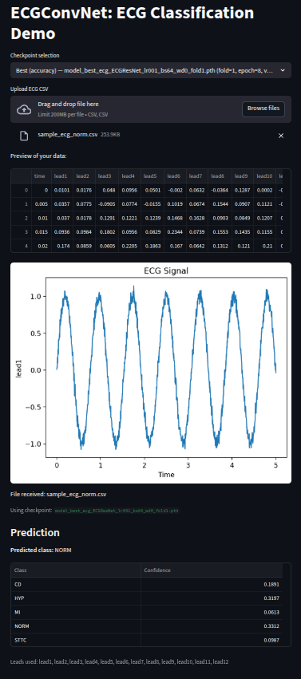

# ECG-CNN (PyTorch) — PTB-XL ECG Classification

[](https://github.com/shaolinpat/ecg_cnn_pytorch/actions/workflows/ci.yml)
[](https://codecov.io/gh/shaolinpat/ecg_cnn_pytorch)  
[](https://www.python.org/downloads/release/python-3110/)
[](LICENSE)


Reproducible, fully-tested deep learning pipeline for 12-lead ECG classification 
on **PTB-XL**. 

Includes clean training/evaluation CLIs, YAML configs + grids, 
SHAP explainability, rich plots, and CSV summaries.

> **For hiring managers:** This repo showcases production-grade ML engineering: 
modular PyTorch, deterministic pipelines, thorough tests, clear experiment 
tracking, and repeatable results.

---

## Highlights

- **End-to-end**: data → training (single/k-fold) → evaluation → reports
- **Modern PyTorch**: simple model registry, schedulers, clean Trainer
- **Config-first**: YAML configs & grid expansion (`configs/`)
- **Explainability**: SHAP channel-importance summaries
- **Artifacts**: PR/ROC/confusion plots, per-fold reports, fold-level summary CSVs
- **Tested**: extensive pytest suite (unit + behavioral), CI-friendly
- **Fast demo**: ships with tiny sample ECGs to run immediately

---

## Repo Structure (trimmed)
```
ecg_cnn_pytorch/
├── configs/        # Baseline & grid configs (YAML)
├── data/
│   ├── sample/     # Tiny CSV sample for quick runs
│   └── ptbxl/      # (Optional) PTB-XL mirror
├── demos/          # Streamlit demo
├── ecg_cnn/        # Core package
│   ├── config/     # Config loader
│   ├── data/       # Dataset & utilities
│   ├── models/     # Model registry & helpers
│   ├── training/   # Trainer + CLI args + utils
│   ├── utils/      # Plotting, validation, grid utils
│   ├── evaluate.py # Evaluation CLI
│   └── train.py    # Training CLI
├── outputs/        # Default artifacts (ignored in git)
├── tests/          # Pytest suite
├── environment.yml # Conda env (recommended)
└── README.md
```

Additional `outputs_*` folders contain precomputed artifacts to illustrate expected results.

---

## Setup

### 1) Clone the repository

Using HTTPS:
```bash
git clone https://github.com/shaolinpat/ecg_cnn_pytorch.git
cd ecg_cnn_pytorch
```

Using SSH:
```bash
git clone git@github.com:shaolinpat/ecg_cnn_pytorch.git
cd ecg_cnn_pytorch
```


### 2) Environment (Conda recommended)

```bash
conda env create -f environment.yml
conda activate ecg_cnn_env
```

*Pip fallback:*

```bash
python -m venv .venv && source .venv/bin/activate
pip install -r requirements.txt
```

---

## Quickstart (no downloads)

The repo includes a **tiny sample dataset** under `data/sample/` so you can exercise the full pipeline in seconds.

```bash
# Train a baseline on the sample data
python -m ecg_cnn.train --config configs/baseline.yaml --sample-only
```

Artifacts land under `outputs/`:
- `outputs/results/` — normalized config + run summaries
- `outputs/models/` — `model_best_*_fold*.pth`
- `outputs/history/` — `history_*_fold*.json`
- `outputs/plots/` — accuracy/loss, ROC/PR, confusion matrices, SHAP
- `outputs/reports/` — per-fold classification reports + aggregated fold summary

---

## Full PTB-XL (optional)

Download and stage PTB-XL via the helper script (PhysioNet account & license acceptance required).

```bash
python scripts/fetch_ptbxl.py
```

Then train (omit `--sample-only`), optionally using a grid:

```bash
python -m ecg_cnn.train --config configs/grid.yaml
# or a compact grid:
python -m ecg_cnn.train --config configs/compact_grid.yaml
```

---

## Evaluation CLI

Evaluate and generate reports + plots:

```bash
python -m ecg_cnn.evaluate --enable_ovr --prefer accuracy
```

Outputs appear in `outputs/plots/` and `outputs/reports/`.

For all command-line options:

```bash
python -m ecg_cnn.evaluate --help
```

---

## Tests

Run the full test suite with coverage and generate a coverage report:

```bash
pytest tests --cov=ecg_cnn --cov-report=term-missing --cov-branch --cov-report=html
```

View the coverage report in a browser (pick by operating system).

Linux:
```bash
xdg-open htmlcov/index.html
```

MacOs:
```bash
open htmlcov/index.html
```

Windows:
```bash
start htmlcov/index.html
```
---

## ECG Classification Explorer

When you launch the exploration app, run 
```bash
streamlit run demos/run_streamlit_ecg_app.py 
```
The app looks for a usable model checkpoint in this order:

1. **Models from training runs**  
   - If you’ve trained on the small sample dataset included in the GitHub repo or downloaded and trained on the full PTB-XL dataset, the app automatically discovers checkpoints saved under `outputs/models/`.  
   - It offers you choices between:
     - *Best by accuracy* → highest validation accuracy  
     - *Best by loss* → lowest validation loss
     - *Latest* → the most recently saved model in the outputs/models folder
     - *Bundled sample* → an artificially create model so the streamlit app has something to work with
   - These appear in the dropdown so you can compare them directly.

2. **Environment override**  
   - You can point the demo to any specific checkpoint by setting:  
     ```bash
     export MODEL_TO_USE=/path/to/model.pth
     ```
   - This takes priority over bundled or user-trained models.

3. **Bundled sample model checkpoint**  
   - If no training has been done, the demo falls back to a lightweight `sample_model_ECGConvNet.pth` provided under `demos/checkpoints/`.  
   - This ensures you always see predictions out of the box, even without running training.


4. **Try the sample files**

   - To get started, use the provided demo CSVs under `demos/samples/`:

     - `sample_ecg_cd.csv` — Conduction Disturbance (CD)
     - `sample_ecg_hyp.csv` — Hypertrophy (HYP)
     - `sample_ecg_mi.csv` — Myocardial Infarction (MI) 
     - `sample_ecg_norm.csv` — Normal rhythm (NORM) 
     - `sample_ecg_sttc.csv` — ST/T Change (STTC) 

   - Or Upload your own CSV with ECG signals. Expected format:  
    - Columns: `lead1`, `lead2`, …, `lead12`  
    - Optional `time` column is supported.  

    - These CVS files will be 1000 rows of data for a ten-second sample.

**What you’ll see in the dropdown**

- User-trained models are listed with tags that indicate whether they were *best by accuracy* or *best by loss*.  
- The bundled checkpoint is labeled as **Demo (bundled)**.  
- The selected model determines the predictions and confidence scores shown under the ECG plot.

**Takeaway**

- You can immediately run the demo and see results without any setup.  
- If you’ve trained your own models, the demo highlights them first, with the bundled demo as a fallback.  
- This mirrors how real ML systems let you compare different checkpoints or evaluation criteria.


### Screenshot of Streamlit Demo

Here’s what the ECG classification demo looks like in action:



The 'Checkpoint Selection' dropdown lets you select between checkpoints:
- **Best (accuracy)** – the model that maximized validation accuracy  
- **Best (loss)** – the model that minimized validation loss  
- **Latest** – the most recent model in output/models  

Below the ECG plot, you’ll see predicted diagnostic classes and confidence scores.


---


## Model Evaluation with Explainability

For deeper analysis (e.g., during development or when reviewing model performance),  
use the evaluation script instead of the demo:

```
python -m ecg_cnn.evaluate --prefer latest
```

This pipeline supports **SHAP explainability**, which means:

- Per-lead importance scores are computed during evaluation  
- A bar chart shows which ECG leads contributed most to the prediction  
- These attributions help explain *why* the model predicted a class  

### Notes

- SHAP explainability appears automatically when SHAP is installed (already in the environment).  
- If the dataset is too small or SHAP is not available, the step is skipped gracefully.  

---

**In short:**  
- *Streamlit demo* → simple, quick, interactive showcase (upload → prediction).  
- *Evaluation scripts* → full research workflow with explainability (plots, metrics, SHAP attributions).


---

---

**Optional extras**

- Some predictions include feature attributions (which leads mattered most).  
- This helps explain *why* the model predicted what it did.  

These extras appear automatically if you run a model that was trained with SHAP explainability enabled.  
In the demo:
- If the uploaded sample is compatible and SHAP is available in the environment,  
  the app will show a bar chart of per-lead importance scores alongside the prediction.  
- If SHAP is not installed or if the sample is too small/unsupported, the app will quietly skip this step.  

End users don’t need to configure anything — it’s automatic.  
Think of it as an “extra insight” that appears when conditions allow, not a separate mode they must enable.


**Why This Matters**

This demo shows how raw healthcare signals can be turned into actionable insights with deep learning.  
It’s designed to look and feel like a real product: quick to launch, intuitive to use, and informative at a glance.  

*No setup beyond a single command and a file upload is required.*

---

⚠️ Disclaimer: This demo is for demonstration and educational purposes only.  
It is **not a medical device** and should not be used for diagnosis or treatment.


---

## License

MIT License (see `LICENSE`).
