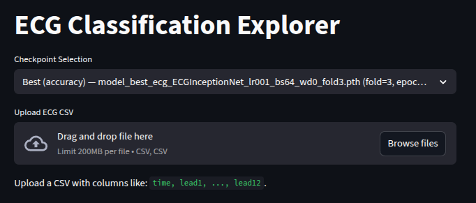
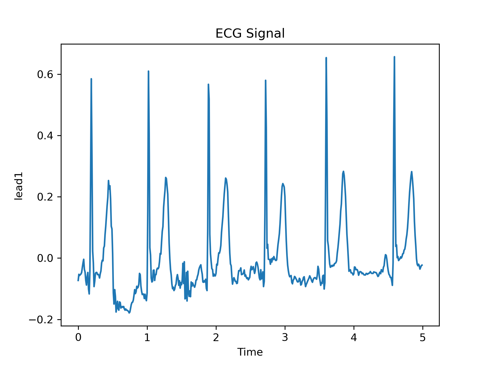
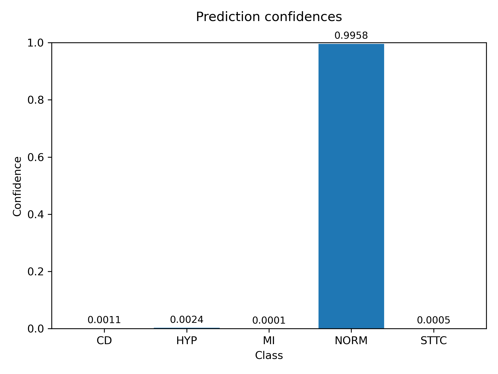
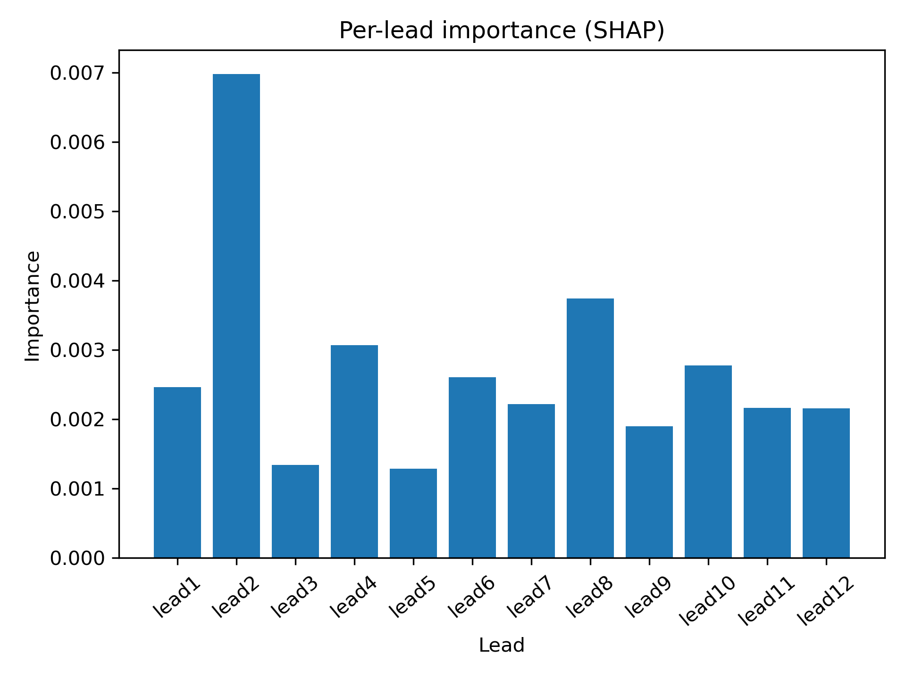

# ECG-CNN (PyTorch) — PTB-XL ECG Classification

[](https://github.com/shaolinpat/ecg_cnn_pytorch/actions/workflows/ci.yml)
[](https://codecov.io/gh/shaolinpat/ecg_cnn_pytorch)  
[](https://www.python.org/downloads/release/python-3110/)
[](LICENSE)


Reproducible, fully-tested deep learning pipeline for 12-lead ECG classification 
on **PTB-XL**. 

Includes clean training/evaluation CLIs, YAML configs + grids, 
SHAP explainability, rich plots, and CSV summaries.

> **For hiring managers:** This repo showcases production-grade ML engineering: 
modular PyTorch, deterministic pipelines, thorough tests, clear experiment 
tracking, and repeatable results.

---

## Table of Contents

- [Why This Project Matters](#why-this-project-matters)
- [Highlights](#highlights)
- [Repo Structure (trimmed)](#repo-structure-trimmed)
- [Setup](#setup)
- [Quickstart (no downloads)](#quickstart-no-downloads)
- [Full PTB-XL Download (optional)](#full-ptb-xl-download-optional)
- [Training](#training)
- [Evaluation CLI with Explainability](#evaluation-cli-with-explainability)
- [ECG Classification Explorer (Streamlit)](#ecg-classification-explorer)
   - [Samples of What You’ll See](#samples-of-what-youll-see)
   - [Takeaway](#takeaway)
- [Disclaimer](#disclaimer)
- [License](#license)

---

## Why This Project Matters

This project shows how raw healthcare signals can be turned into actionable insights with deep learning.  
It’s designed to look and feel like a real product: quick to launch, intuitive to use, and informative at a glance.  

**In short:**  
- *Streamlit explorer* → simple, interactive showcase (upload → prediction)  
- *Evaluation scripts* → full workflow with explainability (plots, metrics, SHAP attributions)  

## Highlights

- **End-to-end**: data → training (single/k-fold) → evaluation → reports
- **Modern PyTorch**: simple model registry, schedulers, clean Trainer
- **Config-first**: YAML configs & grid expansion (`configs/`)
- **Explainability**: SHAP channel-importance summaries
- **Artifacts**: PR/ROC/confusion plots, per-fold reports, fold-level summary CSVs
- **Tested**: extensive pytest suite (unit + behavioral), CI-friendly
- **Fast start**: ships with tiny sample ECGs to run immediately
- **Full data capable**: easily download the full PTB-XL dataset for full runs
---

## Repo Structure (trimmed)
```
ecg_cnn_pytorch/
├── configs/           # baseline and grid configs (YAML)
├── data/
│   ├── sample/        # tiny csv sample for quick runs
│   └── ptbxl/         # optional ptb-xl mirror
├── ecg_cnn/           # core package
│   ├── config/        # config loader
│   ├── data/          # dataset and utilities
│   ├── models/        # model registry and helpers
│   ├── training/      # trainer, cli args, and helpers
│   ├── utils/         # plotting, validation, grid utils
│   ├── evaluate.py    # evaluation cli
│   └── train.py       # training cli
├── explorer/          # streamlit app
├── outputs/           # default artifacts (ignored in git)
├── outputs_12/        # artifacts from grid_12.yaml run
├── outputs_18/        # artifacts from grid_18.yaml run
├── tests/             # pytest suite
├── environment.yml    # conda environment definition (recommended)
├── pyproject.toml     # python packaging metadata (optional)
└── README.md          # project documentation
```

---

## Setup

### 1) Clone the repository

Using HTTPS:
```bash
git clone https://github.com/shaolinpat/ecg_cnn_pytorch.git
cd ecg_cnn_pytorch
```

Using SSH:
```bash
git clone git@github.com:shaolinpat/ecg_cnn_pytorch.git
cd ecg_cnn_pytorch
```


### 2) Environment (conda environment recommended)

```bash
conda env create -f environment.yml
conda activate ecg_cnn_env
```

*Pip fallback:*

```bash
python -m venv .venv && source .venv/bin/activate
pip install -r requirements.txt
```

### 3) Tests

Run the full test suite with coverage and generate a coverage report:

```bash
pytest tests --cov=ecg_cnn --cov-report=term-missing --cov-branch --cov-report=html
```

View the coverage report in a browser (pick by operating system).

Linux:
```bash
xdg-open htmlcov/index.html
```

macOs:
```bash
open htmlcov/index.html
```

Windows:
```bash
start htmlcov/index.html
```
---


## Quickstart (no downloads)

The repo includes a **tiny sample dataset** under `data/sample/` so you can exercise the full pipeline in seconds.

```bash
# Train a baseline on the sample data
python -m ecg_cnn.train --config configs/baseline.yaml --sample-only
```

Artifacts land under `outputs/`:
- `outputs/results/` — normalized config + run summaries
- `outputs/models/` — `model_best_*_fold*.pth`
- `outputs/history/` — `history_*_fold*.json`
- `outputs/plots/` — accuracy/loss, ROC/PR, confusion matrices, SHAP
- `outputs/reports/` — per-fold classification reports + aggregated fold summary

---

## Full PTB-XL Download (optional)

Download and stage PTB-XL via the helper script (PhysioNet account & license acceptance required).

```bash
python scripts/fetch_ptbxl.py
```

## Training

With the full PTB-XL download, omit `--sample-only` from training, which defaults to configs/baseline.yaml. Optionally, specify a configuration file of your choosing. Examples:

```bash
python -m ecg_cnn.train --config configs/compact_grid.yaml
# or for a more robust grid:
python -m ecg_cnn.train --config configs/grid_12.yaml
```

**Note:** Hyperparameter grid searches can take many hours (or even days), depending on the size of the search space, the dataset, and the available hardware. For early exploratory runs, you can reduce runtime by setting sample_frac in the configuration file to a small value (e.g., 0.01 to use 1 percent of the available data).

This command will show all of the command-line arguments you can use:


```bash
python python -m ecg_cnn.train --help
```
---

## Evaluation CLI with Explainability

You can evaluate trained models and generate reports and plots directly from the command line.

### Basic usage
```bash
python -m ecg_cnn.evaluate --enable_ovr --prefer accuracy
```

This will produce outputs in:
- `outputs/plots/` — evaluation plots (confusion matrices, PR/ROC curves, SHAP bar charts)  
- `outputs/reports/` — classification reports and summaries  

### Explainability
The evaluation pipeline supports **SHAP explainability**, which means:

- Per-lead importance scores are computed during evaluation  
- A bar chart shows which ECG leads contributed most to the prediction  
- These attributions help explain *why* the model predicted a given class  

### Additional options
For all available command-line arguments:
```bash
python -m ecg_cnn.evaluate --help
```

---

## ECG Classification Explorer

When you launch the exploration app, run 
```bash
streamlit run explorer/run_streamlit_ecg_app.py 
```
The app looks for a usable model checkpoint in this order:

1. **Models from training runs**  
   - If you’ve trained on the small sample dataset included in the GitHub repo or downloaded and trained on the full PTB-XL dataset, the app automatically discovers checkpoints saved under `outputs/models/`.  
   - It offers you choices between:
     - *Best by accuracy* → highest validation accuracy  
     - *Best by loss* → lowest validation loss
     - *Latest* → the most recently saved model in the outputs/models folder
     - *Bundled sample* → an artificially created model so the streamlit app has something to work with
   - These appear in the dropdown so you can compare them directly.

2. **Environment override**  
   - You can point the explorer to any specific checkpoint by setting:  
     ```bash
     export MODEL_TO_USE=/path/to/model.pth
     ```
   - This takes priority over bundled or user-trained models.

3. **Bundled sample model checkpoint**  
   - If no training has been done, the explorer falls back to a lightweight `sample_model_ECGConvNet.pth` provided under `explorer/checkpoints/`.  
   - This ensures you always see predictions out of the box, even without running training.


4. **Try the sample files**

   - To get started, use the provided sample CSVs under `explorer/samples/`:

     - `sample_ecg_cd.csv` — Conduction Disturbance (CD)
     - `sample_ecg_hyp.csv` — Hypertrophy (HYP)
     - `sample_ecg_mi.csv` — Myocardial Infarction (MI) 
     - `sample_ecg_norm.csv` — Normal rhythm (NORM) 
     - `sample_ecg_sttc.csv` — ST/T Change (STTC) 

   - Or Upload your own CSV with ECG signals. Expected format:  
    - Columns: `lead1`, `lead2`, …, `lead12`  
    - Optional `time` column is supported.  

    - These CSV files will be 1000 rows of data for a ten-second sample.

  - The samples were created using `scripts\make_representative_samples.py` which end users can modify to make their own samples.  

**Checkpoint selection dropdown**

The 'Checkpoint Selection' dropdown lets you select between checkpoints:
- **Best (accuracy)** – the model that maximized validation accuracy  
- **Best (loss)** – the model that minimized validation loss  
- **Latest** – the most recent model in output/models  
- **Bundled sample** - the sample model shipped with the repo so the streamlit explorer can be used immediately
- The selected model determines the predictions and confidence scores shown under the ECG plot.

---

### Samples of What You’ll See

**Streamlit splash screen**  
  
*Initial view of the Streamlit explorer app.*

**Waveform preview**  
  
*A normalized ECG waveform from the uploaded sample file.*

**Prediction confidences**  
  
*Bar chart showing class confidence probabilities, displayed to four decimal places.*

**Per-lead SHAP importance**  
  
*Mean |SHAP| values aggregated per lead, sorted in lead order and displayed with sloped labels for readability.*


### Takeaway

- You can immediately run the explorer and see results without any setup.  
- If you’ve trained your own models, the explorer highlights them first, with the bundled model as a fallback.  
- This mirrors how real ML systems let you compare different checkpoints or evaluation criteria.


**In short:**  
- *Streamlit explorer* → simple, quick, interactive showcase (upload → prediction).  
- *Evaluation scripts* → full research workflow with explainability (plots, metrics, SHAP attributions).


**Notes**

- SHAP explainability appears automatically when SHAP is installed (already in the environment).  
- If the dataset is too small or SHAP is not available, the step is skipped gracefully.  
---

## Disclaimer

⚠️ Disclaimer: This project is for demonstration and educational purposes only.  
It is **not a medical device** and should not be used for diagnosis or treatment.


---

## License

This project is licensed under the [MIT License](LICENSE).


*Built with scikit-learn 1.7.2 · Streamlit 1.49 · Python 3.11*